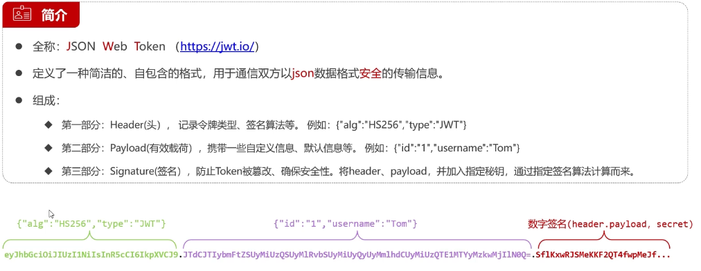
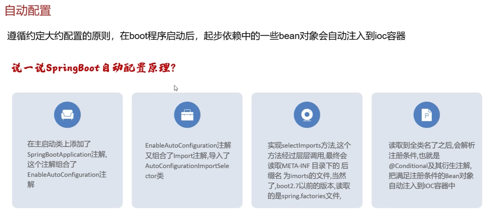

# 登录注册接口3

## JWT令牌，网页如何验证用户

当你登录时，网页会获取你的用户名等等信息然后通过三段做成JWT令牌

### JWT组成:
什么是JWT

Header(头): 记录令牌、签名算法等

Payload(有效荷载): 携带一些自定义信息、默认信息等

Signature(签名): 防止Token被篡改，确保安全性。将头和有效荷载融合并加入密钥，最后使用签名算法得到

你每进入一个页面就要验证你的令牌，错误就重新登录

在实现前要有一下依赖
```
<dependency>
      <groupId>com.auth0</groupId>
      <artifactId>java-jwt</artifactId> //jwt令牌依赖
      <version>4.4.0</version>
    </dependency>
    <dependency>
      <groupId>org.springframework.boot</groupId>
      <artifactId>spring-boot-starter-test</artifactId>  //测试依赖
    </dependency>
```

### 具体代码
    注：将他们放到测试类中使用，要测试的方法前要使用@Test注解
```java
@Test
    public void testGen(){
        Map<String,Object> claims = new HashMap<>();
        claims.put("id",1);
        claims.put("username","张三");
        //生成jwt的代码
        String token = JWT.create()
                .withClaim("user",claims)
                .withExpiresAt(new Date(System.currentTimeMillis() + 1000*60*60*12))
                .sign(Algorithm.HMAC256("itheima"));
        System.out.println(token);
    }

    @Test
    public void testParse(){
        String token = "eyJhbGciOiJIUzI1NiIsInR5cCI6IkpXVCJ9.eyJ1c2VyIjp7ImlkIjoxLC" +
                "J1c2VybmFtZSI6IuW8oOS4iSJ9LCJleHAiOjE3ODEyMjQ2NDF9.M2wD3j6eo_a1j1N" +
                "0JR_7HAGqWNx5abytMZCbD11gPn4";
        JWTVerifier jwtVerifier = JWT.require(Algorithm.HMAC256("itheima")).build();
        DecodedJWT decodedJWT = jwtVerifier.verify(token);
        Map<String, Claim> claims = decodedJWT.getClaims();
        System.out.println(claims.get("user"));
    }
```


## 具体非测试的管理类代码-》实现查看当前网页token令牌
```java
import com.ch.pojo.Result;
import com.ch.utils.JwtUtil;
import jakarta.servlet.http.HttpServletResponse;
import org.springframework.web.bind.annotation.GetMapping;
import org.springframework.web.bind.annotation.RequestHeader;
import org.springframework.web.bind.annotation.RequestMapping;
import org.springframework.web.bind.annotation.RestController;

import java.util.Map;

@RestController
@RequestMapping("/article")
public class ArticleController {
    @GetMapping("/list")
    public Result<String> list(@RequestHeader(name = "Authorization") String token, HttpServletResponse response){
        try{
            Map<String, Object> claims = JwtUtil.parseToken(token);//解析器解析token令牌，解析完放到claims里，解析正确下一步，错误就异常报错
            return Result.success("所有的数据.........");

        }catch(Exception e){            //异常报错来到这里
            response.setStatus(401);
            return Result.error("未登录");
        }
        //return Result.success("所有的数据.........");
    }
}
```

## 修改部分登陆代码，实现登录时生成token令牌
```java
    @PostMapping("/login")
    public Result<String> login(@Pattern(regexp = ("^\\S{5,16}$"))String username,@Pattern(regexp = ("^\\S{5,16}$"))String password){
        //先看看姓名是否在数据库有
        User uname = cjService.findByUserName(username);
        if(uname==null){
            return Result.error("用户名错误");
        }
        if(Md5Util.getMD5String(password).equals(uname.getPassword())){//先将用户输入的密码加密，在和数据库里的密文密码对比
            Map<String,Object> claims = new HashMap<>();//如果密码正确，就会生成对应的token令牌
            claims.put("id",uname.getId());
            claims.put("username",uname.getUsername());
            String token= JwtUtil.genToken(claims);//创建JWT令牌
            return Result.success(token);//登录成功把令牌传给响应信息里
        }
        return Result.error("密码错误");
    }
```
