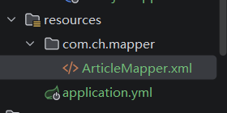

# 分页查询列表
---
## Controller

```java
    @GetMapping
    public Result<PageBean<Article>> list(
            int pageNum,
            int pageSize,                       //注意 int和Integer是有差别的
            @RequestParam(required = false) Integer categoryId,//int为空是0，Integer为空是null，前后端传信息更方便
            @RequestParam(required = false) String state//这里的@RequestParam是选择性接收url数据，而不是和以前一样必须有
    ){
        PageBean<Article> pb = articleService.list(pageNum,pageSize,categoryId,state);
        return Result.success(pb);
    }

```
---
## Service

```java
    @Override
    public PageBean<Article> list(int pageNum, int pageSize, Integer categoryId, String state) {
        PageBean<Article> pb = new PageBean<>();//实例化
        PageHelper.startPage(pageNum,pageSize);//使用PageHelper的startPage方法开启分页查询，记得要引入PageHelper环境
        Map<String,Object> map = ThreadLocalUtil.get();
        int userId = (int) map.get("id");
        List<Article> as = articleMapper.list(userId,categoryId,state);//接受mapper返回的数据
        Page<Article> p= (Page<Article>) as;//强转成page为了之后使用getTotal方法获取总条数等数据
        //分页查询基本的两个数据 total页数    Result页面数据。封装到pb里
        pb.setTotal(p.getTotal());
        pb.setItems(p.getResult());
        return pb;//返回分页查询全部数据
    }
```

### PageHelper配置环境
```xml
    <dependency>
      <groupId>com.github.pagehelper</groupId>
      <artifactId>pagehelper-spring-boot-starter</artifactId>
      <version>1.4.6</version>
    </dependency>
```
---
## Mapper

```java
List<Article> list(int userId, Integer categoryId, String state);
```
使用了映射配置文件实现动态sql
### 映射配置文件

注意要使用映射配置文件必须要路径和配置文件名称相对应，和mapper相对应，如图

```xml
<?xml version="1.0" encoding="UTF-8" ?>
<!DOCTYPE mapper
        PUBLIC "-//mybatis.org//DTD Mapper 3.0//EN"
        "http://mybatis.org/dtd/mybatis-3-mapper.dtd">
<mapper namespace="com.ch.mapper.ArticleMapper">
    <!--使用映射配置文件实现动态sql-->
    <select id="list" resultType="com.ch.pojo.Article">
        select * from article
        <where>
            <if test="categoryId!=null">
                category_id=#{categoryId}<!--where很聪慧，第一个条件加不and，where能看懂，并自动调整-->
            </if>
            <if test="state!=null">
                and state=#{state}
            </if>

            and create_user=#{userId}<!--and是sql语句的 和 ，用来连接条件，但是不是&&，能生效就生效不能就不能不影响后续条件-->
        </where>
    </select>
</mapper>
```


